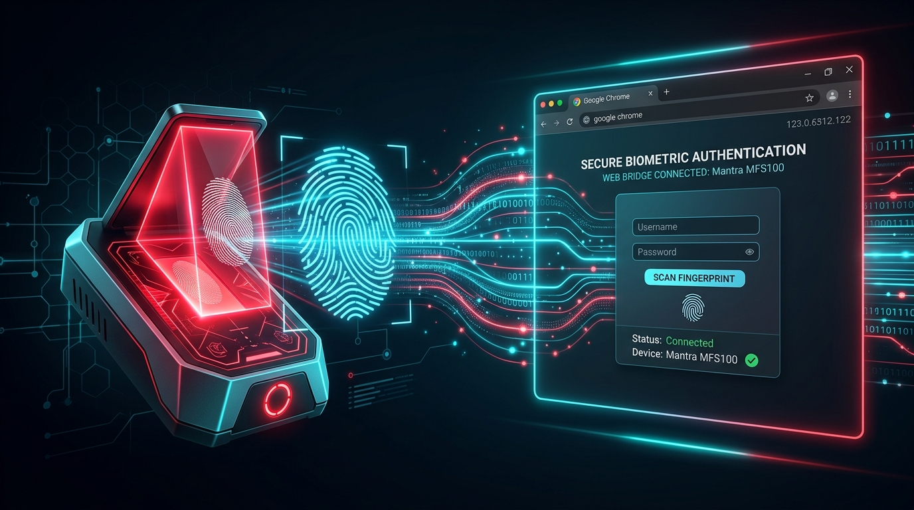

<p align="center">
  
</p>

# Mantra MFS100 Web Bridge (Chrome / Web SDK)

A lightweight, zero-dependency local HTTP service bridge that allows modern web browsers (Google Chrome, Microsoft Edge, Brave, Firefox) to communicate directly with the **Mantra MFS100 (L0)** optical fingerprint scanner for web applications and government portals (such as Maharashtra IGR e-filing `frmPhotoThumbCapture.aspx`).

🌐 **Live Web Tester (Multilingual - English / हिन्दी / मराठी / ગુજરાતી / తెలుగు):** **[https://qalqi.github.io/mfs100client/](https://qalqi.github.io/mfs100client/)**  
🚀 **Developed & Maintained by:** **[qalqi.com](https://qalqi.com)**

---

## 🟢 Verified & Tested Status

- **Operating System:** **Windows 11 (64-bit)** *(Tested & Working)*
- **Hardware Device:** Mantra MFS100 Optical Fingerprint Scanner (USB) *(Tested & Working)*
- **Web Browser:** Google Chrome *(Tested & Working with Private Network Access / PNA)*
- **Target Application:** Maharashtra IGR e-Registration & Leave/License e-Filing (`frmPhotoThumbCapture.aspx`) *(Tested & Working)*
- **Runtime Environment:** Windows PowerShell 5.1 (32-bit `SysWOW64` subsystem) with native `.NET` interop *(No external Node/npm or Python install required)*

---

## 🇮🇳 मराठीत संक्षिप्त सूचना (Quick Guide in Marathi - Maharashtra IGR)

1. **डाउनलोड करा:** [Download ZIP](https://github.com/qalqi/mfs100client/archive/refs/heads/main.zip) वर क्लिक करून झिप फाईल डाउनलोड करा आणि कोणत्याही फोल्डरमध्ये अनझिप करा.
2. **स्कॅनर जोडा:** मंत्रा MFS100 स्कॅनर USB पोर्टमध्ये लावा (इतर चाचणी ॲप्स बंद ठेवा).
3. **सुरू करा:** फोल्डरमधील `start.bat` फाईलवर डबल-क्लिक करा.
4. **परवानगी द्या:** क्रोममध्ये Site Settings &rarr; Insecure content &rarr; **Allow** करा.
5. **चाचणी घ्या:** [लाइव्ह वेब टेस्टर](https://qalqi.github.io/mfs100client/) वर किंवा आपल्या **महाराष्ट्र IGR ई-नोंदणी पोर्टलवर** थेट अंगठ्याचा ठसा स्कॅन करा.

---

## 🇮🇳 ગુજરાતીમાં ઝડપી માર્ગદર્શિકા (Quick Guide in Gujarati)

1. **ડાઉનલોડ કરો:** [Download ZIP](https://github.com/qalqi/mfs100client/archive/refs/heads/main.zip) પર ક્લિક કરીને ઝિપ ફાઇલ ડાઉનલોડ કરો અને અનઝિપ કરો.
2. **સ્કેનર કનેક્ટ કરો:** મંત્રા MFS100 સ્કેનરને USB પોર્ટમાં લગાવો (ડેસ્કટોપ ટેસ્ટ એપ્સ બંધ રાખો).
3. **ચાલુ કરો:** ફોલ્ડરમાં રહેલી `start.bat` ફાઇલ પર ડબલ-ક્લિક કરો.
4. **મંજૂરી આપો:** ક્રોમ સાઇટ સેટિંગ્સમાં Insecure content &rarr; **Allow** કરો.
5. **ટેસ્ટ કરો:** [લાઇવ વેબ ટેસ્ટર](https://qalqi.github.io/mfs100client/) અથવા તમારા પોર્ટલ પર ફિંગરપ્રિન્ટ સ્કેન કરો.

---

## 🇮🇳 हिन्दी में त्वरित निर्देश (Quick Guide in Hindi)

1. **डाउनलोड करें:** [Download ZIP](https://github.com/qalqi/mfs100client/archive/refs/heads/main.zip) पर क्लिक करके रिपोजिटरी को डाउनलोड करें और अनज़िप करें।
2. **स्कैनर जोड़ें:** अपने मंत्रा MFS100 स्कैनर को USB पोर्ट में लगाएं। (MFS100 Test जैसे अन्य सॉफ्टवेयर बंद रखें)।
3. **शुरू करें:** फोल्डर में `start.bat` पर डबल-क्लिक करें।
4. **अनुमति दें:** क्रोम में Site Settings &rarr; Insecure content &rarr; **Allow** करें।
5. **परीक्षण करें:** [लाइव वेब परीक्षक](https://qalqi.github.io/mfs100client/) पर जाएं या अपने पोर्टल पर फिंगरप्रिंट कैप्चर करें।

---

## 🇮🇳 తెలుగులో శీఘ్ర సూచనలు (Quick Guide in Telugu)

1. **డౌన్‌లోడ్ చేయండి:** [Download ZIP](https://github.com/qalqi/mfs100client/archive/refs/heads/main.zip) క్లిక్ చేసి జిప్ ఫైల్ డౌన్‌లోడ్ చేసుకోండి మరియు అన్‌జిప్ చేయండి.
2. **స్కానర్‌ను ప్లగ్ చేయండి:** మంత్ర MFS100 స్కానర్‌ను USB పోర్ట్‌కు కనెక్ట్ చేయండి (డెస్క్‌టాప్ టెస్ట్ యాప్‌లను క్లోజ్ చేయండి).
3. **రన్ చేయండి:** ఫోల్డర్‌లోని `start.bat` పై డబుల్ క్లిక్ చేయండి.
4. **క్రోమ్ సెట్టింగ్:** క్రోమ్ సైట్ సెట్టింగ్స్‌లో Insecure content &rarr; **Allow** చేయండి.
5. **టెస్ట్ చేయండి:** [లైవ్ వెబ్ టెస్టర్](https://qalqi.github.io/mfs100client/) లేదా మీ ప్రభుత్వ పోర్టల్‌లో వేలిముద్రను స్కాన్ చేయండి.

---

## ⚠️ Disclaimer & Limitation of Liability

> [!IMPORTANT]
> **READ CAREFULLY BEFORE USING THIS SOFTWARE:**
> 
> 1. **No Affiliation:** This project is an independent, community-driven open-source initiative developed by [qalqi.com](https://qalqi.com). It is **NOT** affiliated with, endorsed by, sponsored by, or associated in any way with **Mantra Softech India Pvt. Ltd.**, **UIDAI**, the **Government of Maharashtra**, or any government department or authority.
> 2. **"AS IS" - No Warranty:** This software is provided strictly on an **"AS IS"** and **"AS AVAILABLE"** basis, without warranty of any kind, express or implied, including but not limited to the implied warranties of merchantability, fitness for a particular purpose, title, and non-infringement.
> 3. **No Liability:** Under no circumstances and under no legal theory (whether in contract, tort, negligence, strict liability, or otherwise) shall the authors, contributors, or copyright holders be liable for any direct, indirect, incidental, special, exemplary, punitive, or consequential damages (including, without limitation, loss of business, loss of data, identity or authentication discrepancies, administrative fines, legal disputes, system downtime, or financial loss) arising out of or in connection with the use, misuse, or inability to use this software.
> 4. **User Responsibility & Regulatory Compliance:** You, as the end-user or integrator, assume full responsibility for complying with all applicable laws, data privacy regulations, biometric data handling rules, IT security policies, and terms of service of any third-party or governmental portals you interact with.
> 5. **Trademarks:** "Mantra", "MFS100", "MFS110", and any associated logos or product names are trademarks or registered trademarks of their respective owners.

---

## The Problem in 2026

1. **L0 Deprecation for Aadhaar RD:** UIDAI phased out L0 biometric devices in favor of L1 devices (like Mantra MFS110). Consequently, Mantra discontinued the standalone MFS100 Client Service (`MFS100ClientService.exe`).
2. **Legacy Web Applications:** Many state government portals and custom web applications still rely on `mfs100-9.0.2.6.js`, which hardcodes HTTP calls to:
   - `GET http://localhost:8004/mfs100/info`
   - `POST http://localhost:8004/mfs100/capture`
3. **Chrome Security Blocks:** Modern Chrome strictly enforces Private Network Access (PNA) and CORS when public websites call `localhost` / `127.0.0.1`, causing `net::ERR_CONNECTION_REFUSED` or blocked preflight requests.
4. **Hardware Lock Conflicts:** Windows only permits a single exclusive process to hold the USB handle for an MFS100 scanner. If a desktop test application is left open, all web calls fail with error `1307`.

---

## How This Bridge Works

This bridge binds to port **`8004`** and interfaces directly with the official Mantra native driver assembly (`MANTRA.MFS100.dll` v9.0.2.5) included in `.\lib\`.

```
+--------------------------------------------------------------------+
|                      Web Browser (Chrome)                          |
|             https://efilingigr.maharashtra.gov.in                  |
|                    (mfs100-9.0.2.6.js)                             |
+---------------------------------+----------------------------------+
                                  |
               HTTP GET /mfs100/info | HTTP POST /mfs100/capture
               (with Chrome Private Network Access headers)
                                  v
+--------------------------------------------------------------------+
|               MFS100 Local Bridge (run_mfs100.ps1)                 |
|             Listening on http://127.0.0.1:8004/mfs100/             |
+---------------------------------+----------------------------------+
                                  |
                     .NET Native Interop (AutoCapture)
                                  v
+--------------------------------------------------------------------+
|              MANTRA.MFS100.dll (MFS100 Driver v9.0.2.5)            |
|              .\lib\MANTRA.MFS100.dll                               |
+---------------------------------+----------------------------------+
                                  |
                             USB Handle
                                  v
+--------------------------------------------------------------------+
|                 Mantra MFS100 Optical Scanner                      |
|                  (Captures Live Fingerprint)                       |
+------------------------------------+-------------------------------+
```

### Features
- **Zero Third-Party Dependencies:** Uses built-in Windows PowerShell and the official Mantra DLL.
- **Real Biometric Capture:** No dummy or synthetic data. Generates authentic Base64 **BMP images** and **ISO 19794-2 templates**.
- **Chrome PNA Compliant:** Automatically serves `Access-Control-Allow-Private-Network: true` to pass Chrome's strict security preflights.
- **Auto Sensor Control:** Automatically illuminates the optical red LED on capture request and turns it off after successful scan or timeout.

---

## API Endpoints

### 1. Device Handshake (`/mfs100/info`)
- **Method:** `GET`
- **Path:** `/mfs100/info`
- **Response:**
  ```json
  {
    "ErrorCode": "0",
    "ErrorDescription": "Success",
    "DeviceInfo": {
      "Make": "Mantra",
      "Model": "MFS100",
      "SerialNo": "1510682",
      "Width": "316",
      "Height": "354",
      "Certificate": ""
    }
  }
  ```

### 2. Biometric Capture (`/mfs100/capture`)
- **Method:** `POST`
- **Path:** `/mfs100/capture`
- **Behavior:** Turns on red LED, polls for finger placement (up to 15s timeout), verifies minimum quality threshold ($\ge 30$), extracts ISO 19794-2 template, and encodes uncompressed 8-bit grayscale BMP to Base64.
- **Response:**
  ```json
  {
    "ErrorCode": "0",
    "ErrorDescription": "Success",
    "BitmapData": "<Base64 BMP Image String>",
    "IsoTemplate": "<Base64 ISO 19794-2 Template String>",
    "AnsiTemplate": "",
    "RawData": "",
    "Quality": 78,
    "Nfiq": 1,
    "WsqImage": ""
  }
  ```

---

## Quick Start Guide

### Prerequisites
1. Windows 10 or **Windows 11 (64-bit)**.
2. Mantra MFS100 fingerprint scanner connected via USB.
3. Close any desktop test utility (`MANTRA.MFS100.Test.exe`) before starting.

### Running the Bridge
Simply double-click **`start.bat`**, or run in PowerShell:
```powershell
& "C:\Windows\SysWOW64\WindowsPowerShell\v1.0\powershell.exe" -ExecutionPolicy Bypass -File "run_mfs100.ps1"
```

You will see:
```text
==========================================================
[OK] MFS100 Hardware Bridge listening on port 8004
[OK] Device: Mantra MFS100
[OK] Ready for Chrome! Click Capture on your IGR page.
==========================================================
```

---

## Chrome Browser Configuration

1. In Chrome, open: `chrome://flags/#allow-insecure-localhost`
   - Set to **Enabled** and click **Relaunch**.
2. On your government / IGR portal tab (or GitHub Pages tester):
   - Click the site settings icon (left of URL bar).
   - Ensure **Insecure Content** is set to **Allow**.
   - Ensure **Camera** is set to **Allow** (for photo capture).

---

## Troubleshooting

| Error Code / Symptom | Cause | Solution |
| :--- | :--- | :--- |
| `1307` in logs | Device in use by another program | Close `MANTRA.MFS100.Test.exe` on desktop |
| `ERR_CONNECTION_REFUSED` on 8004 | Bridge is not running | Run `start.bat` |
| `TypeError: Cannot set properties of null (setting 'srcObject')` | Camera blocked / no webcam | Set Chrome camera permissions to "Allow" |
| `Port 8004 in use` | Another process is holding 8004 | Run `Get-NetTCPConnection -LocalPort 8004` and stop the PID |

---

## 💬 Issues & Community Support

If you encounter any issues, bugs, or have questions while running this bridge on your machine:

1. **Search Existing Issues:** Check the [GitHub Issues](https://github.com/qalqi/mfs100client/issues) page to see if your issue has already been discussed.
2. **Open a New Issue:** If your issue is not listed, report it here:  
   👉 **[Create a New Issue on GitHub](https://github.com/qalqi/mfs100client/issues/new)**
3. **What to include in your issue description:**
   - **Windows Version:** (e.g., Windows 11 Pro 64-bit)
   - **Browser & Version:** (e.g., Chrome 123.x)
   - **Target Web Portal:** (e.g., Maharashtra IGR `frmPhotoThumbCapture.aspx` or custom app)
   - **Terminal Output:** Any messages printed in the `start.bat` console window
   - **DevTools Console Log:** Errors displayed under `F12` > Console tab in Chrome

---

## License

This project is licensed under the **MIT License** - see the [LICENSE](LICENSE) file for details. Built by [qalqi.com](https://qalqi.com).
